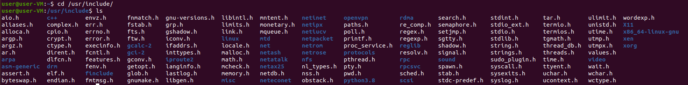

# HW0105 - Where is the header file?
我是怎麼找到的 `<stdio.h>` 的呢？

首先，我認為 `<stdio.h>` 應該是 GCC 的東西，因為我沒有寫過 `<stdio.h>`，而電腦本身又不寫程式，所以應該也不需要 `<stdio.h>`。 

所以我 Google 「ubuntu header path」，看到了[c - Where are header files for GCC located? - Ask Ubuntu](https://askubuntu.com/questions/573417/where-are-header-files-for-gcc-located)。文中說了應該會在 `/usr/include` 或 `/usr/local/include`。

所以我先 `cd` 到 `/usr/include/`，然後 `ls` 列出目錄底下的檔案，看看有沒有 `stdio.h`。

然後就找到了。

接著試著用 `sudo` 提權把它移除。

本來可以執行的，移除 `stdio.h` 後出現了找不到 `stdio.h` 的錯誤迫使編譯中止。

最後再把它移回去又可以正常編譯了。