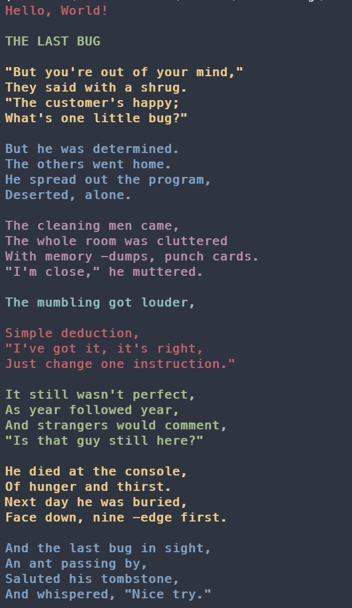

# HW 2.6 - Bonus: Colorful Output

我們可以用 ANSI 跳脫序列 (ANSI Escape Sequences) 來改變輸出的表現風格，像是粗體及顏色等。

其結構為 `ESC[` 加上後方的一或多個以 `;` 分割的參數，並以 `m` 結尾。

在這個作業中，我們將使用 ANSI 跳脫序列讓輸出變成**粗體紅色文字**。

`\033` 代表的是 `ESC` (ESCape)，因為 `ESC` 不是可視字元。

```c
int main() {
    // 將風格設為租體(1)、紅色文字(31)
    printf("\033[1;31m");

    // 輸出要輸出的內容
    printf("Hello World\n");

    // 重設回初始的風格
    printf("\033[0m");

    return 0;
}
```

我們也可以寫個簡單的函式讓我們輸出各種顏色：

```c
#include <stdio.h>
#define STRING_COUNT 9
#define MAX_SIZE 200

char article[STRING_COUNT][MAX_SIZE] = {
    "THE LAST BUG",
    "\"But you're out of your mind,\"\nThey said with a shrug.\n\"The customer's happy;\nWhat's one little bug?\"",
    "But he was determined.\nThe others went home.\nHe spread out the program,\nDeserted, alone.",
    "The cleaning men came,\nThe whole room was cluttered\nWith memory -dumps, punch cards.\n\"I'm close,\" he muttered.",
    "The mumbling got louder,",
    "Simple deduction,\n\"I've got it, it's right,\nJust change one instruction.\"",
    "It still wasn't perfect,\nAs year followed year,\nAnd strangers would comment,\n\"Is that guy still here?\"",
    "He died at the console,\nOf hunger and thirst.\nNext day he was buried,\nFace down, nine -edge first.",
    "And the last bug in sight,\nAn ant passing by,\nSaluted his tombstone,\nAnd whispered, \"Nice try.\""
};

int front_color = 91;

void ranbow_print(char str[]) {
    for (int i = 0; str[i] != '\0'; i++) {
        printf("\033[1;%dm%c\033[0m", front_color, str[i]);
    }
    front_color = front_color == 96 ? 91 : front_color + 1;
}

int main() {
    ranbow_print("Hello, World!\n\n");
    for (int i = 0; i < STRING_COUNT; i++) {
        ranbow_print(article[i]);
        printf("\n\n");
    }
    return 0;
}
```

借用了一下 hw0101 的文章。是不是看起來比純白的清楚舒服呢？



> 注意：要有限度的使用色彩，要不然會適得其反，讓人看起來很花。
