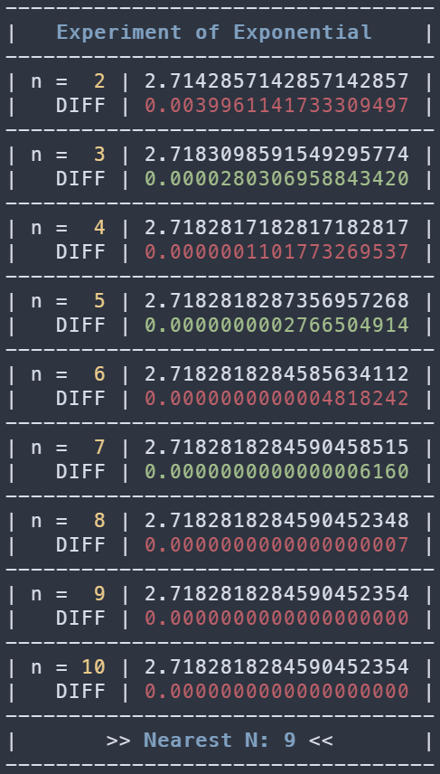

# HW 0304 Experiment of Exponential

資工系 114 級 林振可 (41047029S)

In the code `hw0304.c`, we use `calc_e(n)` to calculate the value of $e$ at n "precision".

We can change the code a little bit to make it find a suitable value of n:

```c
long double last = 0, nearest_dist = 100;
int64_t nearest = 0;
for (int64_t n = 2; n <= 1e9; n++) {
    long double e = calc_e(n);
    if (e == last) break;
    last = e;
    if (dist < nearest_dist) {
        nearest_dist = dist;
        nearest = n;
    }
}
```

Let's see what the result is:



The green DIFF color means the calculated value is greater than the given truth.

While the red DIFF color means the calculated value is less than or equal to the given truth.

After `n = 9`, we get the same result as before (2.7182818284590452354), the same as the given truth.

The nearest n that makes $e$ most close to the given truth is `n = 9`.

The source code of the experiment is available in `hw0304.1.c`.
